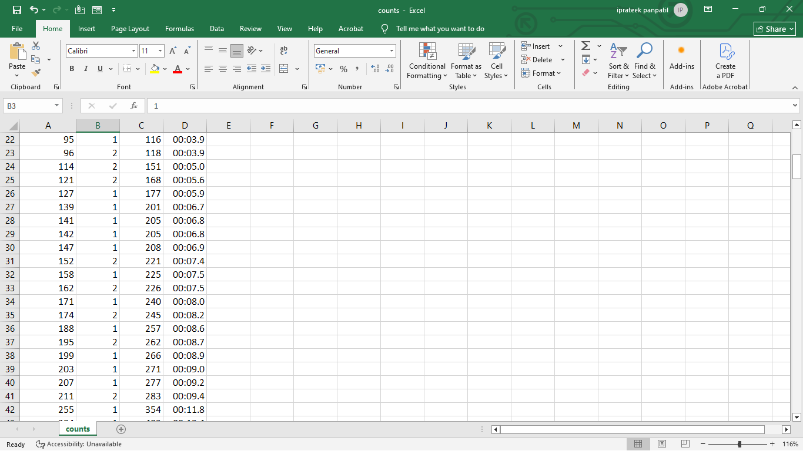
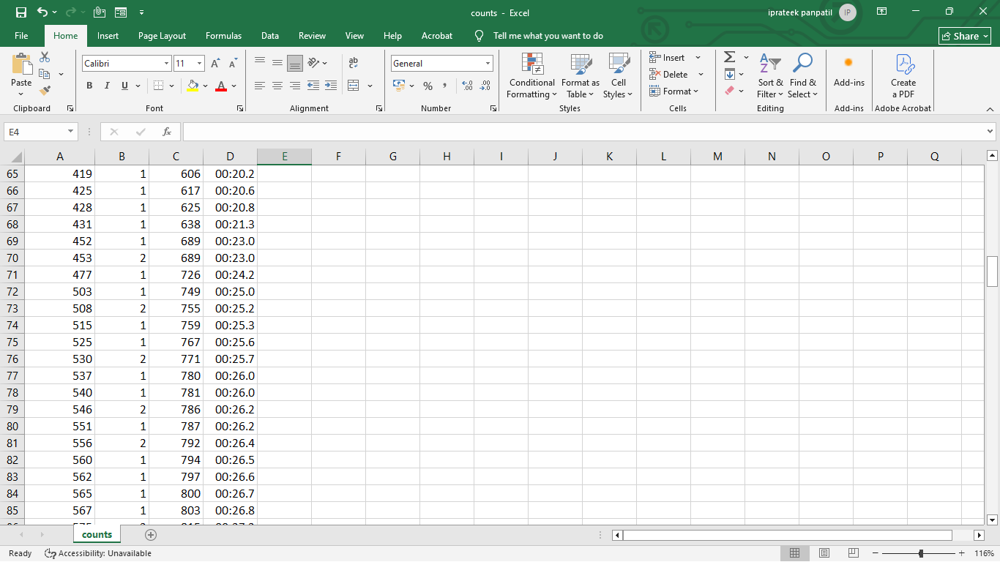

# 🚦 Traffic Flow Analysis Starter

This project analyzes traffic flow from video input using computer vision.  
It detects vehicles, counts them, and generates useful insights with annotated outputs.

---

## 🎥 Demo Video

- [Watch on Google Drive](https://drive.google.com/file/d/1YW3uhd7axu5TIvib5niqjqgFOSPsJE4s/view?usp=sharing)  
- [Download from GitHub](Captured.mp4)

---

## 📸 Screenshots

### Vehicle Count Results

| Screenshot 1 | Screenshot 2 |
|--------------|--------------|
|  |  |

| Screenshot 3 | Screenshot 4 |
|--------------|--------------|
|  |  |

---

## ✨ Features
- Detects and tracks vehicles from traffic videos  
- Counts number of vehicles per lane  
- Generates annotated output video  
- Exports vehicle counts to CSV for analysis  

---

## 🛠 Tech Stack
- Python  
- OpenCV  
- NumPy  
- Pandas  

---

## 🚀 How to Run

1. Clone this repository  
   ```bash
   git clone https://github.com/yourusername/traffic-flow-analysis-starter.git
   cd traffic-flow-analysis-starter
